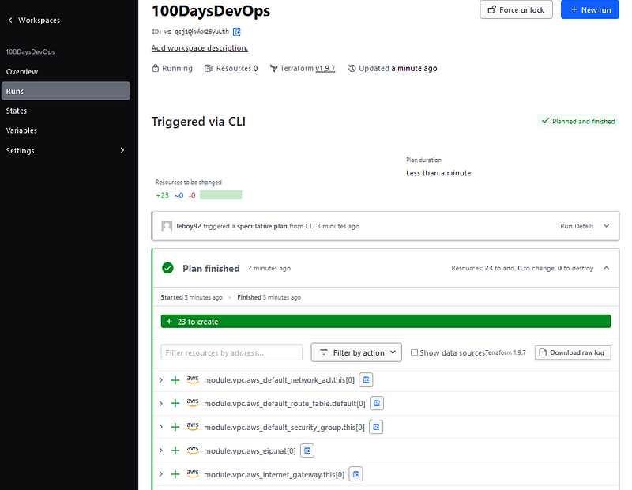
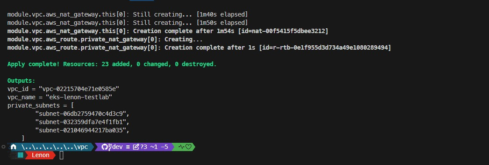
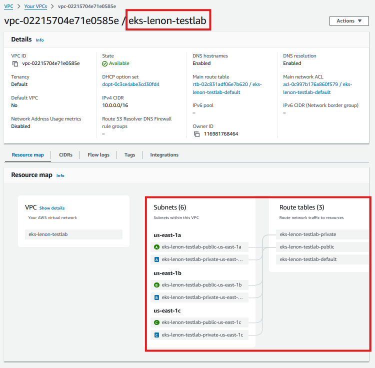

# How I Finally Mastered Kubernetes Infrastructure


## The Struggle We All Know Too Well
*"Setting up Kubernetes is supposed to be easy, they said. Just follow the documentation, they said."* I still chuckle whenever I think about that night. It was 2 a.m., and there I was, muttering under my breath, buried in error logs, clutching a half-empty cup of cold coffee, and feeling the weight of pure frustration. Hours had slipped by as I struggled with EKS (Elastic Kubernetes Service). Each misconfigured node felt like a jab to my confidence. I had to find a way to wrangle this Kubernetes beast once and for all.

## The Breakthrough Moment
It didn't happen overnight. The breakthrough began unexpectedly during a chat with a fellow engineer who was sharing his excitement about something that honestly sounded way too good to be true: Terraform Blueprints and Argo CD.

He described how automating EKS deployments with Terraform had saved his team hours of work and made their infrastructure, in his words, "almost boringly reliable." That last part made me laugh, but I was intrigued. The secret sauce? Pairing Terraform Blueprints with Argo CD to create a GitOps-driven continuous delivery pipeline.

I'll admit, I was skeptical. But there was a spark that made me believe things could be different. And that tiny spark? It was enough to get me started on what would soon become a game-changing, transformative project.

## Why I Chose This Route
Sometimes, desperation really does push you to innovate. I was exhausted, mentally and physically. I needed a way to make these infrastructure deployments foolproof, efficient, and repeatable. The way I had been doing things, manually scripting every piece, left too much room for slip-ups. And trust me, there were more late-night "Oh no" moments than I'd care to admit.

I knew diving into this approach would be tough, but I was determined. Let's dive deep into the setup and how I was able to accomplish all this.

---

## Prerequisites
- **Basic knowledge of Terraform**, including understanding workspaces.
- **Basic knowledge of Argo CD**: Familiarity with Argo CD concepts such as Application, ApplicationSet, Projects, App of App pattern, and Generator types (Cluster, Git, Matrix).
- **Proficiency with Git CLI commands**: clone, commit, pull, push.
- **Basic understanding of GitOps Bridge**.
- **Basic knowledge of Helm** for application deployment.

---


## Amazon VPC Architecture
Before diving into the Kubernetes section, I had to tackle setting up a reliable Amazon VPC. I knew from past mistakes that a strong network foundation was crucial, so I approached this with care, using Terraform to automate the setup.

### Building a Resilient Foundation: The VPC Design
I created a VPC with public and private subnets across multiple Availability Zones. Why? Because spreading resources across different data centers ensures high availability and resilience. If one zone goes down, the others keep running.

- **Public Subnets**: For internet-facing resources like load balancers, with an Internet Gateway attached for external access.
- **Private Subnets**: For sensitive resources like databases and application servers, hidden from the public internet. These would use a NAT Gateway for secure outbound traffic.

> **Note**: For this lab, a single NAT Gateway will be used. In production environments, it's recommended to have a NAT Gateway in each Availability Zone for high availability and fault tolerance.

This architecture became the foundation for my EKS clusters. Knowing everything was distributed and secure made me confident that my deployments could handle failures gracefully. This time, I was finally doing things right.

---

## Preparing for EKS
### Script to Create Necessary Files
This script will create the necessary files for your Terraform project in one go. Once the files are created, you can follow the easy steps below to paste the code into the right places.

```bash
#!/bin/bash

# Step 1: Set up the Terraform project directory
mkdir -p environment/vpc
cd environment/vpc

# Step 2: Create empty Terraform configuration files
touch providers.tf
touch variables.tf
touch main.tf
touch outputs.tf
touch locals.tf
touch README.md
touch data.tf

echo "🎉 All necessary files have been created in ~/environment/vpc! Now, let's get them filled with the right code. Follow the instructions below."

```

# Adding Code to Each File

- Open `providers.tf` and paste the following code:

```bash
terraform {
  required_version = ">= 1.7.0"
  required_providers { 
    aws = {
      source  = "hashicorp/aws" 
      version = ">= 5.73.0"
    }
    random = {
      version = ">= 3"
    }
  }
  # I am using terraform cloud for my backend.
  cloud {                                
    organization = "AWS-100DaysofDevOps" 
    workspaces {
      name = "100DaysDevOps" 
    }
  }
}

# Configure the AWS provider for the primary region
provider "aws" {
  # Configuration options
}

provider "random" {
  # Configuration options
}

```

- Open `variables.tf` and paste the following code:

```bash
variable "environment_name" {
  description = "The name of the environments Infrastructure stack used for cluster and vpc"
  type = string
  default = "eks-lenon-testlab"
}


variable "vpc_cidr" {
  description = "CIDR block for the VPC"
  type = string
  default = "10.0.0.0/16"
}


```

- Open `main.tf` and paste the following code:

```bash
# leaveraging aws  vpc module

module "vpc" {
  source  = "terraform-aws-modules/vpc/aws"
  version = "~> 5.0.0"

  name = local.name
  cidr = local.vpc_cidr

  azs             = local.azs
  public_subnets  = [for k, v in local.azs : cidrsubnet(local.vpc_cidr, 6, k)]
  private_subnets = [for k, v in local.azs : cidrsubnet(local.vpc_cidr, 6, k + 10)]

  enable_nat_gateway   = true
  create_igw           = true
  enable_dns_hostnames = true
  single_nat_gateway   = true

  manage_default_network_acl    = true
  default_network_acl_tags      = { Name = "${local.name}-default" }
  manage_default_route_table    = true
  default_route_table_tags      = { Name = "${local.name}-default" }
  manage_default_security_group = true
  default_security_group_tags   = { Name = "${local.name}-default" }

  public_subnet_tags = {
    "kubernetes.io/role/elb" = 1
  }

  private_subnet_tags = {
    "kubernetes.io/role/internal-elb" = 1
    # Tags subnets for Karpenter auto-discovery
    "karpenter.sh/discovery" = local.name
  }

  tags = local.tags

}


```

- Open `outputs.tf` and paste the following code:

```bash
output "vpc_id" {
  description = "The ID of the VPC"
  value       = module.vpc.vpc_id
}

output "private_subnets" {
  description = "List of IDs of private subnets"
  value       = module.vpc.private_subnets
}

output "vpc_name" {
  description = "The ID of the VPC"
  value       = local.name
}
```

- Open `locals.tf` and paste the following code:

```bash
locals {
  name   = var.environment_name
  region = data.aws_region.current.id

  vpc_cidr       = var.vpc_cidr
  num_of_subnets = min(length(data.aws_availability_zones.available.names), 3)
  azs            = slice(data.aws_availability_zones.available.names, 0, local.num_of_subnets)

  tags = {
    Blueprint  = local.name
    Purpose = "Self-study"
    Author = "Lenon Nformbui"
    GithubRepo = "https://github.com/lnformbu/AWS-Projects/tree/main/EKS-for-Terraform-and-ArgoCD"
  }
}
```

- Open `data.tf` and paste the following code:

```bash
data "aws_availability_zones" "available" {
  # Do not include local zones
  filter {
    name   = "opt-in-status"
    values = ["opt-in-not-required"]
  }
}


data "aws_region" "current" {}

```

## Provision VPC:

Initialize Terraform to get required modules and providers

- Initialize Terraform: `terraform init`

- Preview the Changes: `terraform plan`


- Deploy the VPC: `terraform apply -auto-approve`


**💡 Tip:** The VPC creation might take a few minutes (5 or more). Once completed, you'll see the outputs, including your VPC ID and private subnets.
can see the VPC in the console



