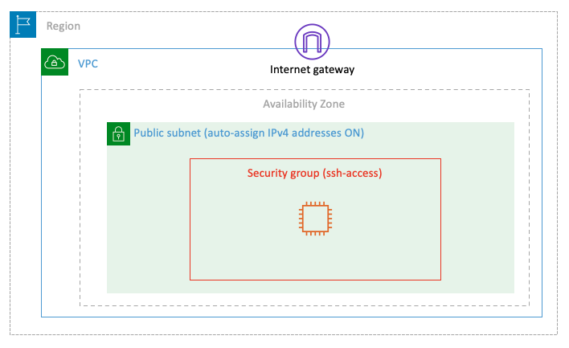

# Project Name 
`Lab-001`

## Goal
 The goal of this lab is to deploy a single EC2 instance in a public subnet accessible over the Internet via SSH.


# Lab-001

## A Single EC2 Instance

Difficulty Level: Simple

## Architecture Diagram



## Guide

In order to complete the above goal for this lab, you will have to go through the following steps:

1. Select the operating system by choosing an [Amazon Machine Image (AMI)](https://docs.aws.amazon.com/AWSEC2/latest/UserGuide/AMIs.html).
2. Set up the virtual hardware by selecting an [Instance Type](https://docs.aws.amazon.com/AWSEC2/latest/UserGuide/instance-types.html).
3. Check the network configuration.
4. Verify the storage settings.
5. Optionally, create tags for the instance. (Recommended)
6. Configure the firewall rules by setting up a [Security Group](https://docs.aws.amazon.com/vpc/latest/userguide/VPC_SecurityGroups.html).
7. Launch the instance, and either choose or create an [EC2 key pair](https://docs.aws.amazon.com/AWSEC2/latest/UserGuide/ec2-key-pairs.html).


Let's get started! Head over to the [AWS Console](https://console.aws.amazon.com/) and log in with your credentials. From the top left, click on **Services**, then select **EC2** under the Compute section.

### Step 1 - Select the AMI
In the EC2 service menu, click on *Launch instance* and choose *Launch Instance* and name it `lab-001`


Choose the *Amazon Linux 2 AMI*. An AMI is a pre-configured template containing the necessary software (OS, application server, applications) to launch an instance. For this lab, we'll use the x86 architecture.

Amazon Linux 2 comes with five years support. It provides Linux kernel 5.10 tuned for optimal performance on Amazon EC2, systemd 219, GCC 7.3, Glibc 2.26, Binutils 2.29.1, and the latest software packages through extras. This AMI is the successor of the Amazon Linux AMI that is now under maintenance only mode and has been removed from this wizard.


### Step 2 - Select the Instance Type
The instance type determines the CPU, memory, and network performance of the instance. You can select the free-tier eligible instance type, then proceed by clicking _Next: Configure Instance Details_.


### Step 3 - Create a key pair
You can use a key pair to securely connect to your instance. Ensure that you have access to the selected key pair before you launch the instance.

click create new


On the `Create Key Pair` page enter the following;
key pair name = `lab-001`
Key pair type  = `RSA`
Private key file format = `.pem`
Next select `Create Key Pair`


This will be downloaded  to your computer (it will be saved as *lab-001.pem*).


### Step 4 - Configure Network Settings
Ensure the public `default subnet` is selected, and the *Auto-assign Public IP* option is enabled. Leave other settings as default.


A *Security Group* acts as a firewall for your instance. Create a new security group named `*ssh-access*` and add a rule allowing SSH access from anywhere (or restrict it to *My IP* if preferred).


Next: Add Storage_ to.

### Step 5 - Configure Storage
Accept the default settings to create an EBS root volume.


Click _Next: Add Tags_.


### Step 6 - Add Tags (Optional)
Tags allow you to add metadata to your AWS resources for easier management. 
key = `Deployment_type`
Value = `console-lab-001`


### Step 7 - Launch the Instance
Review all your settings.

If everything looks good, click _Launch_.


You will see a new screen showing the launch status.


Click  the `instances_id` or the `EC2 Dashboard` to see a list of instances, including the one you just created.


## Test & Validation
Once the instance is running, select it in the EC2 console and click on *Connect*.


From the new window, copy the example SSH command, which will look something like this:


``` bash
$ ssh -i "lab-001.pem" ec2-user@ec2-100-25-181-143.compute-1.amazonaws.com
```

The username ec2-user is the default for Amazon Linux AMIs, and the DNS name (e.g., ec2-100-25-181-143.compute-1.amazonaws.com) is automatically generated by AWS. Open a terminal and navigate to the folder where the key file lab-001.pem is saved. Adjust the key file permissions:

```bash
$ chmod 400 lab-001.pem
```

Paste the SSH command `ssh -i "lab-001.pem" ec2-user@ec2-100-25-181-143.compute-1.amazonaws.com` into the terminal and execute it to log into your instance. If you're using Windows, you can use Putty to connect. Follow this [guide](https://docs.aws.amazon.com/AWSEC2/latest/UserGuide/concepts.html) for instructions.


# BONUS:

You get the Terraform code for this. [GitHub Link]()